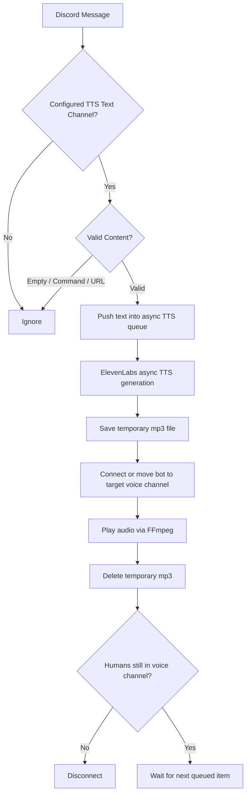

<div align="center">

# Echoify
### Discord TTS Bot powered by ElevenLabs

<p>
  
  
  
  
  
</p>

<p>
  A lightweight Discord TTS bot that reads messages from a designated text channel,
  converts them into speech with <b>ElevenLabs</b>, and plays them in a designated voice channel.
</p>

</div>

---

## Overview

Echoify is a small but practical Discord bot for voice-based server interactions.
It lets administrators choose one text channel for automatic message reading and one voice channel for audio playback.
It also supports manual speech requests with a command-based queue.

The current codebase includes:

- a **Discord bot entrypoint**
- a **TTS Cog** for commands, listeners, and background tasks
- an **async ElevenLabs TTS engine**
- a **dotenv-based configuration layer**
- pinned dependencies for **Python 3.11**

---

## Tech Stack

<p align="left">
  
  
  
  
</p>

### Key Dependencies

- **Python 3.11**
- **discord.py[voice]** for bot commands and voice connections
- **ElevenLabs Python SDK** for async text-to-speech generation
- **python-dotenv** for environment variable loading
- **FFmpeg** for audio playback inside Discord voice channels

---

## Features

- Read messages automatically from a configured text channel
- Speak messages in a configured voice channel
- Queue TTS requests to avoid overlapping playback
- Manual `!say` command for one-off speech requests
- Automatic disconnect when no human users remain in the voice channel
- Startup cleanup for leftover generated `.mp3` files
- Basic filtering for commands, empty messages, and URL-only messages
- Long-message truncation at 300 characters

---

## Architecture



---

## Project Structure

```bash
.
├── bot.py
├── config.py
├── tts_engine.py
├── .env.example
├── requirements.txt
└── cogs/
    └── tts_cog.py
```

---

## How It Works

1. The bot starts and removes leftover `tts_*.mp3` files from previous runs.
2. An administrator sets:
   - the text channel for automatic TTS
   - the voice channel for output
3. Messages posted in the chosen text channel are filtered and queued.
4. The TTS engine sends text to ElevenLabs and saves the result as an `.mp3` file.
5. The bot joins or moves to the configured voice channel and plays the audio through FFmpeg.
6. The file is deleted after playback.
7. A background loop disconnects the bot when the voice channel becomes empty of human users.

---

## Requirements

Before running the project, make sure you have:

- **Python 3.11**
- **FFmpeg** installed and available in your system `PATH`
- a **Discord bot token**
- an **ElevenLabs API key**
- an **ElevenLabs Voice ID**

### Install FFmpeg

#### macOS
```bash
brew install ffmpeg
```

#### Ubuntu / Debian
```bash
sudo apt update
sudo apt install ffmpeg
```

#### Windows
Install FFmpeg and ensure `ffmpeg.exe` is available from your system `PATH`.

---

## Installation

### 1) Clone the repository

```bash
git clone <your-repo-url>
cd <your-repo-name>
```

### 2) Create and activate a virtual environment

#### macOS / Linux
```bash
python3.11 -m venv .venv
source .venv/bin/activate
```

#### Windows (PowerShell)
```powershell
python -m venv .venv
.\.venv\Scripts\Activate.ps1
```

### 3) Install dependencies

```bash
pip install -r requirements.txt
```

### 4) Prepare the folder structure

If needed, move the cog file into a `cogs` directory:

```bash
mkdir -p cogs
mv tts_cog.py cogs/tts_cog.py
```

### 5) Create your `.env`

Copy the example file and fill in your actual values.

#### macOS / Linux
```bash
cp .env.example .env
```

#### Windows (PowerShell)
```powershell
Copy-Item .env.example .env
```

Example:

```env
DISCORD_TOKEN=your_discord_bot_token
ELEVENLABS_API_KEY=your_elevenlabs_api_key
VOICE_ID=your_elevenlabs_voice_id
```

---

## Environment Variables

| Variable | Description |
|---|---|
| `DISCORD_TOKEN` | Discord bot token |
| `ELEVENLABS_API_KEY` | ElevenLabs API key |
| `VOICE_ID` | ElevenLabs voice ID used for synthesis |

---

## Running the Bot

```bash
python bot.py
```

If everything is configured correctly, the bot will log in and clean up any stale generated audio files at startup.

---

## Discord Commands

| Command | Description | Permission |
|---|---|---|
| `!settextch` | Set the current text channel as the auto-TTS input channel | Administrator |
| `!setvoicech` | Set your current voice channel as the TTS output channel | Administrator |
| `!ttsinfo` | Show the currently configured text and voice channels | Everyone |
| `!say <text>` | Queue a message manually for speech | Everyone |
| `!leave` | Force the bot to leave the current voice channel | Everyone |

### Example flow

```text
!settextch
!setvoicech
!ttsinfo
!say Hello everyone, welcome to the server.
```

---

## Runtime Notes

- Channel IDs are stored in **runtime memory**, not in a database.
- That means the configured text/voice channels will reset when the bot restarts.
- Messages starting with `!` are ignored by the auto-TTS listener.
- Messages starting with `http` are ignored to avoid reading raw links.
- Messages over 300 characters are truncated before synthesis.
- If audio is already playing, the bot stops the current playback before starting the next queued item.

---

## Troubleshooting

### The bot starts but does not speak

Check the following:

- the bot has permission to **connect** and **speak** in the voice channel
- `!setvoicech` was run after joining a voice channel
- `VOICE_ID` and `ELEVENLABS_API_KEY` are valid
- FFmpeg is installed correctly

### No automatic reading in the text channel

Make sure:

- `!settextch` was run in the intended channel
- the message is not empty
- the message does not start with `!`
- the message does not start with `http`

---

## Suggested Improvements

If you want to evolve this project further, good next steps would be:

- persistent guild-specific settings with SQLite or PostgreSQL
- per-user voice selection
- slash command support
- message language detection
- queue status command
- Docker deployment
- rate-limit and retry handling for TTS failures
- richer URL filtering and content sanitization

---

## Source Files Reflected in This README

This README was written based on the current implementation of:

- `bot.py`
- `tts_cog.py`
- `tts_engine.py`
- `config.py`
- `.env.example`
- `requirements.txt`

---

